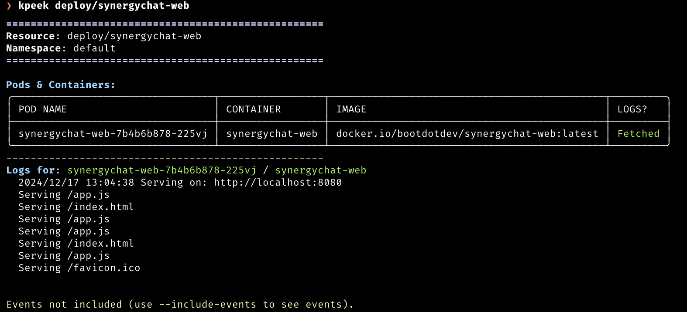

# kpeek

  



**kpeek** is a command-line tool that aggregates describe output, container logs, and (optionally) events for a given Kubernetes resource. It simplifies debugging and provides a clean, colorized, human-readable report.

## Features

- **Describe-like Output:** Quickly see essential details for a Pod or Deployment.
- **Pod Discovery:** If you provide a Deployment, `kpeek` finds its Pods automatically.
- **Logs (Optional):** View logs from each container in your Pods with color highlighting.
- **Events (Optional):** Fetch resource-level and Pod-level events in a concise table.
- **JSON Output:** Switch to machine-readable JSON for automated processing.

## Installation

- Go Install  

```bash
go install github.com/hacktivist123/kpeek@latest
```

> [!NOTE]
> You might need to add `$HOME/go/bin` to Your `$PATH` after installation

- Build From Source

```bash
git clone https://github.com/hacktivist123/kpeek.git
cd kpeek
go build -o kpeek .
./kpeek --help
```

- Run With `go run`

```bash
git clone https://github.com/hacktivist123/kpeek.git
cd kpeek
go run main.go --help
```

## Usage

```bash
kpeek [resource/type-name] [flags]
```

### Flags

| Flag        |    Purpose |
| ------------|------------|
| `n, --namespace string` | Kubernetes namespace of the resource (default: default).|
| `--json` | Output in JSON format. |
| `--no-logs` | Skip retrieving container logs. |
| `--include-events` | Include events in the output.|
| `--log-tail int` | Display only the last N lines of logs (`0` for all) |
| `--log-regex` | Regular expression to filter log lines |

## Contributing

- Fork this repository and clone your fork.
- Create a feature branch: git checkout -b feature/my-feature
- Make changes and commit: git commit -m 'Add my feature'
- Push to your fork: git push origin feature/my-feature
- Open a Pull Request describing your changes.

All contributions, bug reports, bug fixes, documentation improvements, enhancements, and ideas are welcome.

## License

This project is licensed under the MIT License. See the [LICENSE](./LICENSE) file for details.
